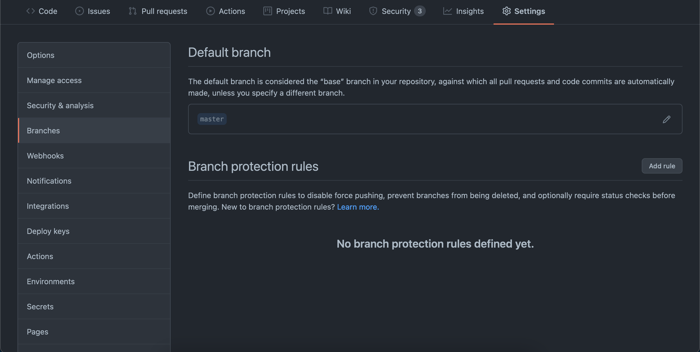
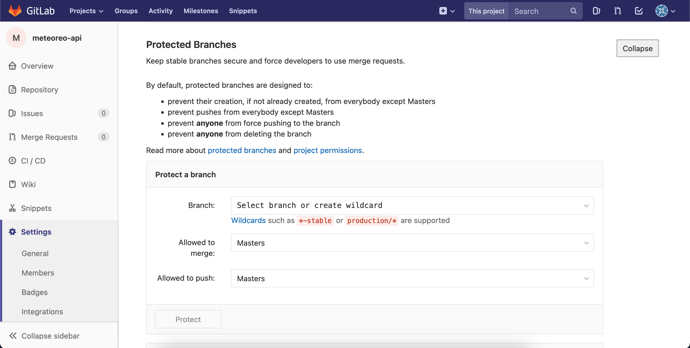

## Implementación de metodologías de **integración contínua** para equipos medianos de desarrollo

`<Teo González Calzada/>`


Las mayores ventajas

- Reducción de *riesgo*
- Mayor *control*


Desventajas

- Requiere *conocimiento*
- Requiere de mantenimiento contínuo


Las herramientas son de uso general, pero hablaremos de ellas en un contexto específico.


Las metodologías son solo acuerdos y convenciones, si no se siguen, no funcionan.


## Git

Pieza fundamental de la integración contínua.


Lo ideal, es establecer restricciones en los repositorios remotos para no permitir prácticas que no van de acuerdo a las metodologías establecidas.


### Ramas

`dev -> testing -> production`

`dev -> validation -> master`

`dev -> main`

```
feature/*
fix/*
hotfix/*
```


## **Protección**

Si queremos forzar una convención específica. Los host de código ofrecen facilidades para ello.








## Commits

Es recomendado tener una convención de commits, idioma, categoría, relevancia, tareas relacionadas, todo esto es información valiosa que se puede tener en un commit.

[conventional commits .org](https://www.conventionalcommits.org/en/v1.0.0/)


## Reglas de commits

Cada plataforma ofrece su propio sistema de reglas, pero generalmente se puede agregar la revisión como un elemento más de la ejecución del pipeline.

Ej. [action para github](https://github.com/beemojs/conventional-pr-action) o [semantic release para gilab](https://faun.pub/git-flow-and-semantic-release-with-gitlab-be54b2c64818)


No se suben archivos compilados, y preferentemente tampoco librerías a los repositorios de los proyectos.


## Proveedores de **ejecución** de integración contínua

- Gitlab (CI)*
- Github (Actions)
- Jenkins*
- CircleCI

Mención honorífica: Netlify


*Nota: Cryptomining*

*Debido al reciente auge de criptominería, los minutos gratuitos que los los servicios de integración contínua ofrecen han bajado y los precios aumentado.*

Véase [Crypto miners are killing free CI](https://webapp.io/blog/crypto-miners-are-killing-free-ci/)


## Docker

Es una plataforma para crear contenedores de software, una sencilla forma de **estandarizar** imágenes.


Permiten tener versiones específicas de software, como servidores de autenticación, bases de datos con una versión específica.


**Devcontainers**


